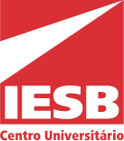

# Nome do projeto / Backend

## Resumo

Informar o objetivo do projeto.

## Tecnologias

- Nest.js
- TypeScript

## Rodando localmente

Clone o projeto:

```bash
  git clone https://github.com/fabrica-bayarea/nome-do-projeto.git
```

Mude para a pasta recém-criada:

```bash
  cd nome-do-projeto
```

Instale as dependências:

```bash
  npm install
```

Inicie a aplicação:

```bash
# development
$ npm run start

# watch mode
$ npm run start:dev

# production mode
$ npm run start:prod
```

Executando os testes:

```bash
# unit tests
$ npm run test

# e2e tests
$ npm run test:e2e

# test coverage
$ npm run test:cov
```

## Autores

Abaixo temos uma lista de pessoas que participaram deste projeto ao longo dos anos.

### Equipe 1º/2023

| E-mail | Nome | Função |
| ------ | ---- | ------ |
